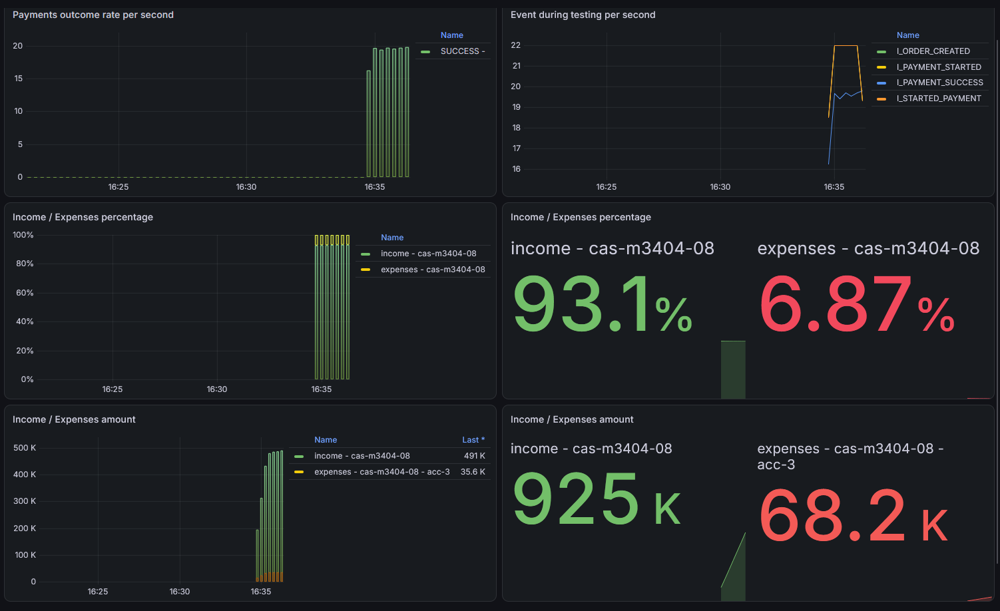
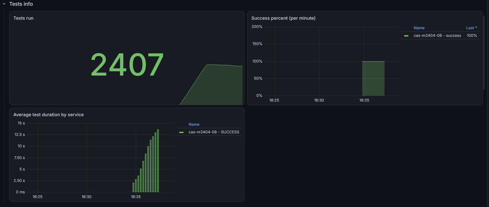

## Кейс #1

**Задание:** обработать входящий поток заказов со скоростью `ratePerSecond = 11` (`testCount = 1200`), передавая оплаты во внешнюю платёжную систему через аккаунт `acc-3` с соблюдением его лимитов (`rateLimitPerSec`, `parallelRequests`).

### Решение

**`AccountWorker`** - отдельный воркер на каждый аккаунт:

- **Явная очередь** `LinkedBlockingQueue` фиксированного размера (10 000) - основа back pressure. При переполнении платёж не принимается, а не копится в неявных очередях, которые скрыты внутри библиотек.
- **Rate limit** соблюдается блокирующим `tickBlocking()` на скользящем окне (`SlidingWindowRateLimiter`) прямо в loop-потоке воркера. Скользящее окно выбрано вместо фиксированного, потому что оно устойчиво к «двойной» пиковой нагрузке на стыке окон.
- **Ограничение параллельности** через `Semaphore(parallelRequests)`, который захватывается **до** постановки задачи в executor. Это исключает накопление неограниченной очереди внутри `ThreadPoolExecutor`.
- **Учёт `deadline`**: просроченные платежи отбрасываются до отправки, чтобы не тратить деньги на заведомо бесполезные вызовы.

**`PaymentSystemImpl`** - вместо рассылки платежа сразу во все аккаунты выбирает **один** аккаунт через round-robin и передаёт задачу в соответствующий воркер.

**Дополнительно:**
- Таймауты OkHttp выставлены с учётом `averageProcessingTime` внешней системы.
- Конфигурация: `payment.accounts=acc-3`, параметры теста в `test-local-run.http` (`ratePerSecond: 11`, `testCount: 1200`).

### Результаты теста (Grafana)

